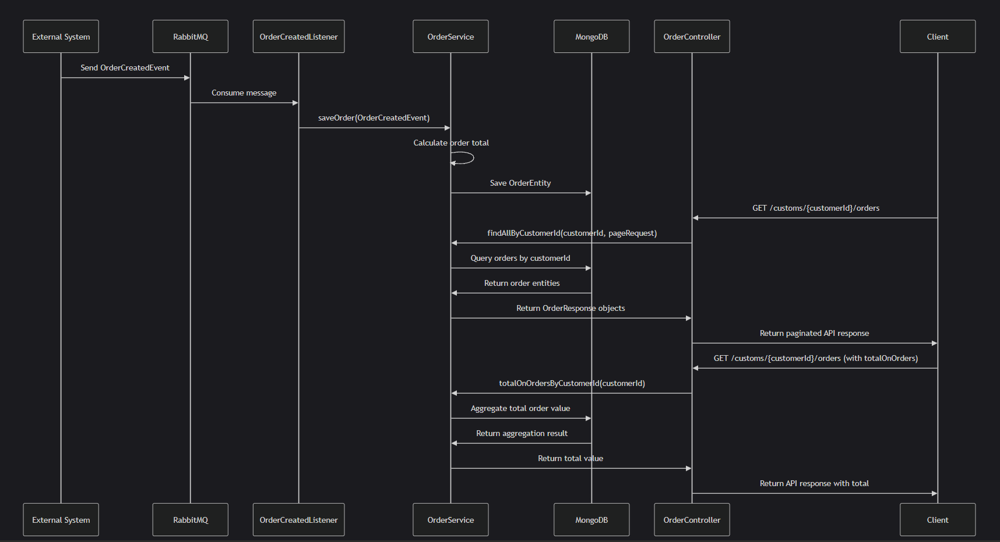

# RabbitMQ MongoDB Integration API

This project demonstrates the integration between RabbitMQ and MongoDB in a Spring Boot application. The application receives order events via RabbitMQ, stores them in MongoDB, and provides REST endpoints to query the stored data.

## Architecture Overview

The application follows a microservice architecture pattern where:
1. Order creation events are received via RabbitMQ
2. The events are processed and stored in MongoDB
3. REST API endpoints allow querying the stored data

### Sequence Diagram


## Technologies Used

- **Spring Boot**: Framework for building the application
- **RabbitMQ**: Message broker for asynchronous processing
- **MongoDB**: NoSQL database for storing order data
- **Swagger/OpenAPI**: API documentation
- **Docker**: Containerization for local development

## Setup Instructions

### Prerequisites
- Java 17 or higher
- Docker and Docker Compose

### Running the Application

1. Start the required infrastructure using Docker Compose:
   ```bash
   cd local
   docker-compose up -d
   ```

2. Build and run the Spring Boot application:
   ```bash
   ./mvnw clean install
   ./mvnw spring:run
   ```

3. The application will be available at:
   - API: http://localhost:8080

### Infrastructure

- **MongoDB**: Available at `localhost:27017`
  - Username: admin
  - Password: 123
  - Database: meuBancoDeDados

- **RabbitMQ**: 
  - AMQP: `localhost:5672`
  - Management UI: `http://localhost:15672`

## API Documentation

### List Orders by Customer ID

```
GET /customs/{customerId}/orders
```

Retrieves a paginated list of orders for a specific customer.

**Parameters:**
- `customerId` (path, required): ID of the customer to retrieve orders for
- `page` (query, optional): Page number (zero-based), default: 0
- `pageSize` (query, optional): Number of items per page, default: 10

**Responses:**
- `200 OK`: Successfully retrieved orders
- `404 Not Found`: Customer not found

**Response Body Example:**
```json
{
  "metadata": {
    "totalOnOrders": 1250.75
  },
  "data": [
    {
      "orderId": 12345,
      "customerId": 1001,
      "total": 750.25
    },
    {
      "orderId": 12346,
      "customerId": 1001,
      "total": 500.50
    }
  ],
  "pagination": {
    "page": 0,
    "pageSize": 10,
    "totalElements": 2,
    "totalPages": 1
  }
}
```

## Message Structure

### OrderCreatedEvent

```json
{
  "codigoPedido": 12345,
  "codigoCliente": 1001,
  "itens": [
    {
      "produto": "Product Name",
      "quantidade": 2,
      "preco": 375.12
    }
  ]
}
```

## Data Model

### Order Entity
- `orderId`: Long (Primary Key)
- `customerId`: Long (Indexed)
- `total`: BigDecimal
- `item`: List of OrderItemEntity

### Order Item Entity
- `product`: String
- `quantity`: Integer
- `price`: BigDecimal

## Usage Examples

### Publishing an Order Event to RabbitMQ

Using the RabbitMQ management UI or a client library, publish a message to the queue `myFirstQueue` with content:

```json
{
  "codigoPedido": 12345,
  "codigoCliente": 1001,
  "itens": [
    {
      "produto": "Smartphone",
      "quantidade": 1,
      "preco": 1299.99
    },
    {
      "produto": "Phone Case",
      "quantidade": 2,
      "preco": 29.99
    }
  ]
}
```

### Querying Orders via REST API

```bash
# Get orders for customer 1001
curl -X GET "http://localhost:8080/customs/1001/orders?page=0&pageSize=10" -H "accept: application/json"
```

## Development

The project uses Spring Boot's standard project structure:
- `controller`: REST API endpoints
- `service`: Business logic
- `domain`: Data model and repositories
- `dto`: Data transfer objects
- `listener`: Message consumers
- `config`: Application configuration